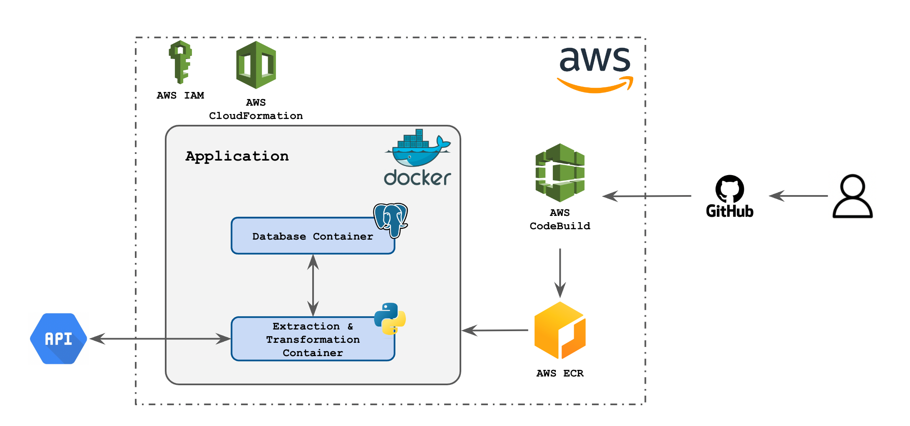
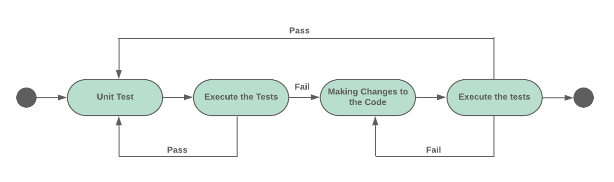
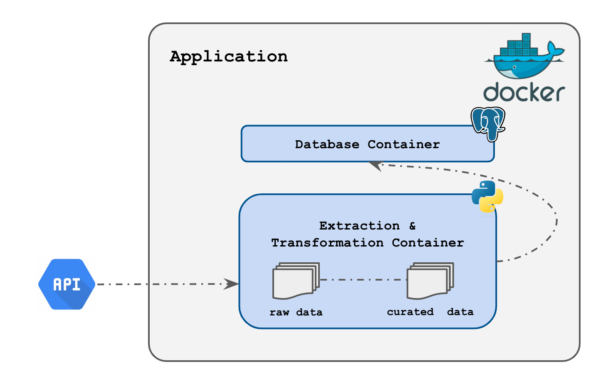

<h1 align="center"> 

  <strong>Jobs Data Ingestion Application</strong>

</h1>

<div align="center">


  <a href="coverage"></a>
  <a href="tests"></a>

  <a href="python version"></a>
  <a href="requests version"></a>
  <a href="psycopg2"></a>
  <a href="pytest"></a>
  <a href="pytest-mock"></a>

</div>

## **1. Project Structure**

The solution that relies on this code repository, is divided into the following modules:

- [`cloud`](./cloud/): where you can find all the resources used to push the solution to AWS. We've used CloudFormation to enforce the adoption of Infrastructure as Code;

- [`docker`](./docker/): all the code used to containerize the application is available in this folder. The solution presented involved the creation of the two Docker containers and this folder, and the way this one is organized, reflects the adoption of those containers;

- [`documentation`](./documentation/): all the resources used in the documentation of the repository;

- [`ingestion`](./ingestion/):  divided into two layers: [app](./ingestion/app/) and [tests](./ingestion/tests/). On the first one, you can find all the code that our application leverages. On the second, you can see all the test case scenarios that our code was tested against.

## **2. Solution**

The following image reflects not only all the modules that our solution involves but also the way they interconnect among themselves.



### **2.1. Dataset Definition**

The key task of this challenge is the formulation of a dataset composed by that scraped from an API. To handle this procedure in a proper manner, we've divided this requisite into the following submodules.

#### **2.1.a. TDD (_Test Driven Development_)** 

To guarantee that the code produced to address the challenge is not only within the quality standards but that it also performs as expected in multiple case scenarios, we have adopted TDD.

TDD (i.e. _Test Driven Development_) is a software engineering technique that converts all the software requirements of our application into test cases. This means that every single function developed was tested against multiple test case scenarios with different complexity levels.

**This will ensure that the probability of our application facing bugs, in the long run, will be residual.**

The image below depicts how TDD works and the multiple stages that define this development principle.



To run the tests access the CLI of the usajobs-extraction image and follow the guidelines below:

````
# pwd
/usajobs
# python3 -m pytest
````

#### **2.1.b. API Requets**

As already mentioned in the Introduction, one of the goals is the extraction of data from an API. For this, I've used the python library `requests`, this way I was able to make **GET** requests in a syntax that is pythonic and simple and get the data.

The code that reflects the way my application gets the data from the API can be seen on the [`api.py`](./ingestion/app/engine/python/extractor/api.py) script.

#### **2.1.c. Feature Selection**

Among all the columns that our GET request returns we have selected the following features:

1. `PositionID`;
2. `PositionTitle`;
3. `PositionURI`;
4. `PositionLocation`;
5. `OrganizationName`;
6. `DepartmentName`;
7. `PositionSchedule`;
8. `PositionOfferingType`;
9. `PositionRemuneration`.

These are the features that our pipeline keeps for further transformations and loading procedures.

#### **2.1.d. Data Transformations**

A considerable part of the extracted and kept fields are nested dictionaries and/or arrays. Taking this into account, a set of data transformations was developed to prepare the data for the loading procedure.

It's important to highlight the following transformations and the correspondent effects that result as an outcome:
##### **A. `preen`**

```
    Input:
    {
        'firstLevel': {
            'attribute_1': 2
        }
    }

    Output:
    {
        'firstLevel_attribute_1': 2
    }
```

This function is responsible for tackling all the hierarchies present in a nested dictionary, this is achieved by bringing all the sub-levels to the same level as the parent node.

##### **B. `convert_to_array`**

```
    Input:
        [
            {'subkey1': 1, 'subkey2': 2},
            {'subkey1': 3, 'subkey2': 4}
        ]

    Output:
        {
            'subkey1': [1, 3], 
            'subkey2': [2, 4]
        }
```

When there's a list of dictionaries that contain the same keys, this function is responsible for aggregating all the values of each key in a list.

Other than the ones mentioned, there are also other function that the pipeline leverage.

#### **2.1.e. Data Loading**

To load data, we've developed a set of functions that ease the contact between the data assets and the Postgres database where we want to load the data.

These functions and further documentation can be found on the [`postgres.py`](./ingestion/app/engine/python/extractor/postgres.py) script. However, it's important to mention that:

- `get_insert_query` is the function that returns the query to insert new records into an existing table;

- `get_create_query` is used to obtain the query that allows the creation of a table.

### **2.2. Containerization**

To containerize this application two different containers were built and linked. One of the containers possesses a Postgres database - that persists the data on the host - and the second container contains all the code that is used to extract the data from the API.

The image below intends to provide clarification on how this container is established and how the multiple containers interact with each other.



All the docker-related resources can be found under this folder, and the organization that it possesses reflects the existence of the two containers mentioned.

To create the containers on your own Docker environment, please run the following command **when sitting on the project directory**:

```
>> docker-compose -f docker/docker-compose.yaml up
```

### **2.3. Pull the Pipeline to AWS**

On the cloud strand, we had to leverage [IaC](./cloud/) (i.e. Infrastructure as Code) practices, and for that reason, I ended up using CloudFormation to that effect.

In addition to the previous statement, a CodeBuild pipeline guarantees that every modification on your GitHub repository is caught and applied to your cloud resources.

To pull the docker container built to the elected cloud provided, AWS ECR (Elastic Container Registry) was used.


#### **2.3.a. CodeBuild**

CloudBuild is leveraged to create a direct link between the development that is published into the code repository and AWS. This way whenever there are new updates on the first one, these are caught by this service and the targeted stack gets updated immediately.

To make this happen a webhook was created on the repository directly. 

#### **2.3.b. AWS ECR (Elastic Container Registry)**

All the images mentioned in the Containerization chapter were duly kept in a repository on the AWS ECR service.

## **3. Dependencies**

In addition to the dependencies highlighted by the shields at the very beginning of the repo, it is also important to mention the version of the remaining stack used.

- `Docker`: 20.10.17
- `aws-cli`: 2.9.13

To run the CloudFormation code, please make sure that you have the aws-cli duly configure.

## **A. Acknowledgments**

- SonarQube to check if there's optimizations that the code produced could also be an interesting point to explore;

- To prevent some unpleasant surprises with the data obtained from the API a data quality framework should also be implemented. This would make sure that our data is closer to production-level actions (reporting and data science, for example).

- One of the specifications of the challenge was to handle the secrets adequately, although this solution tackles all the features requested initially, **this one is missing**. The ideal way to do this would be to **create a secret on the Secrets Manager of AWS** and read all the sensitive credentials from there.

  A code that would allow this would be (for example):

  ````
  import boto3

  def get_secret(secret_name: str) -> Dict:
      """Get secret credentials and information from AWS secret manager."""

      aws_session = boto3.session.Session()
      aws_client = aws_session.client(service_name="secretsmanager", region_name="eu-west-1")
      aws_secret_value = aws_client.get_secret_value(SecretId=secret_name)

      return json.loads(aws_secret_value["SecretString"])
  ````

- As mentioned previously, our development was guided by a TDD approach however, within the time window that I had at my disposal, I recognize that there might be some exception test cases that were not fully covered. 


## **B. Challenges Faced**

In the multiple development stages of the application, we've faced some challenges, especially on the step that performs the data extractions from the API and also on the process that pulls the application to AWS.

### **1. Dataset creation**
During the extraction and handling of the data we found two particular challenges:

- Although not mentioned in the official documentation of the API, some records have an `AddressLine` field within the `PositionLocation`. Since this feature is not mentioned in the documentation, all the records containing these fields were excluded;

- When you look for jobs outside the States you will probably catch records that do not contain `CityName` features. Since this was only verified on positions that were out of the scope of this challenge, these records ended up being excluded from the final dataset.

### **2. Pull the App to AWS**

Due to the limitations of the aws-cli version that I used, it was not possible to create `AWS::ECR::Image` resources with CloudFormation inside of an existing ECR repository. To workaround this limitation, you have to keep the repository name always on the tag attribution procedure that is performed on the CodeBuild pipeline.
